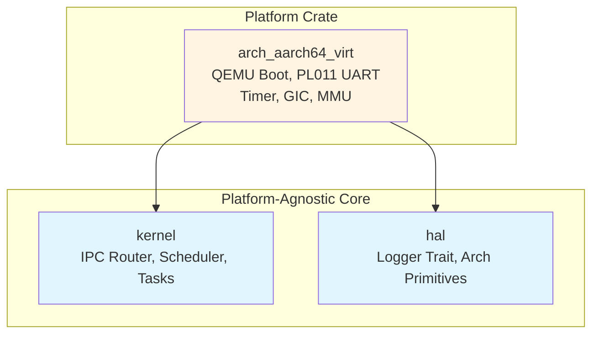
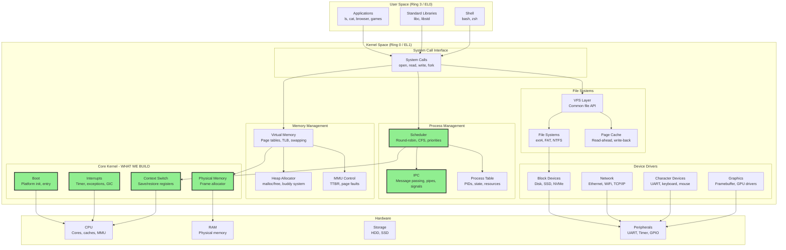

# rust-microkernel

A minimal microkernel in Rust for learning OS fundamentals. Boots on AArch64 QEMU virt, with a 5-part blog series from power-on to virtual memory.

[](LICENSE)
[](https://www.rust-lang.org/)

## Architecture overview

rust-microkernel follows a **platform-agnostic core** design pattern. The `kernel` crate knows nothing about hardware. All platform-specific code is isolated in the `arch_aarch64_virt` crate.



## What you'll learn

This isn't just a toy project. You'll build the actual foundation of every operating system. The diagram below shows a complete OS architecture. We focus on building the **highlighted core kernel components** that everything else depends on:



### Core mechanisms (what we build)

**Boot sequences** - How a CPU goes from power-on to running your first line of Rust. ARM exception level transitions (EL2 to EL1), stack setup, BSS zeroing, and the handoff to Rust code.

**Interrupts and exceptions** - Hardware signals that tell the CPU "stop what you're doing." ARM Generic Timer and GICv2 configuration, exception vector tables, and why interrupts are critical for responsive systems.

**IPC and scheduling** - Message-passing IPC (microkernel philosophy), cooperative and preemptive multitasking, context switching (save/restore 31 registers plus state), and fair scheduling.

**Memory management** - Virtual memory with 4-level page tables (L0 through L3), MMU configuration (TCR, MAIR, TTBR registers), frame allocation, and VA-to-PA translation.

### What we don't build (and why)

We skip filesystems, networking, user mode, multicore, and security hardening. These are important, but they all build on the foundation we teach. Part 4 has extension paths for going deeper.

## Blog series

Comprehensive **5-part tutorial series** covering OS fundamentals from motivation to virtual memory:

**[Part 0: Why build an OS from scratch?](https://blog.desigeek.com/post/2026/02/building-microkernel-part0/)**
- Series overview, motivation, and roadmap
- What we're building and why AArch64 QEMU virt
- The big picture: complete OS architecture
- Prerequisites, quick start, and how to use the series

**[Part 1: Foundations - Boot and platform abstraction](https://blog.desigeek.com/post/2026/02/building-microkernel-part1/)**
- EL2 to EL1 drop, stack setup, BSS zeroing
- PL011 UART: talking to hardware via MMIO
- Platform-agnostic kernel and HAL abstraction
- ARM assembly primer and linker scripts

**[Part 2: Communication - IPC and cooperative scheduling](https://blog.desigeek.com/post/2026/03/building-microkernel-part2/)**
- Message-passing IPC (vs shared memory)
- Mailbox router with backpressure
- Task abstraction and trait-based design
- Cooperative scheduling (round-robin)
- Ping/Pong demo showing communication

**[Part 3: Concurrency - Interrupts, timers and preemption](https://blog.desigeek.com/post/2026/03/building-microkernel-part3/)**
- ARM Generic Timer and GIC architecture
- Exception vector table and IRQ handling
- Preemptive multitasking with full context switching
- Thread A/B demo proving preemption works

**[Part 4: Memory management and beyond](https://blog.desigeek.com/post/2026/03/building-microkernel-part4/)**
- Physical frame allocator (bump allocator for 4KB pages)
- 4-level page tables and descriptor format
- MMU configuration (TCR_EL1, MAIR_EL1, TTBR0_EL1)
- VA to PA translation and TLB operation
- Extension roadmap and resources for deeper learning

## Quick start

### Option 1: Just run it (Docker, any OS)

No toolchain needed. Works on **Windows**, **macOS**, and **Linux**.

```bash
docker pull amitbahree/rust-microkernel:latest
docker run -it amitbahree/rust-microkernel:latest
# Inside the container:
./scripts/build-aarch64-virt.sh && ./scripts/run-aarch64-virt.sh
# Press Ctrl+A then X to exit QEMU
```

### Option 2: Build from source

The steps below get you running quickly. For detailed setup (system requirements, verification, troubleshooting, VM options), see [docs/DEVELOPMENT_SETUP.md](docs/DEVELOPMENT_SETUP.md).

#### Linux / macOS / WSL2

```bash
# System dependencies (Ubuntu/Debian)
sudo apt update && sudo apt install -y build-essential curl git qemu-system-aarch64

# macOS: brew install qemu

# Install Rust nightly + AArch64 target (skip if already installed)
curl --proto '=https' --tlsv1.2 -sSf https://sh.rustup.rs | sh
source $HOME/.cargo/env
rustup default nightly
rustup target add aarch64-unknown-none
rustup component add rust-src --toolchain nightly

# Build and run
git clone https://github.com/bahree/rust-microkernel.git
cd rust-microkernel
./scripts/build-aarch64-virt.sh
./scripts/run-aarch64-virt.sh
# Press Ctrl+A then X to exit QEMU
```

#### Windows

Use **WSL2** (recommended) or **Docker**. WSL2 gives you a full Linux environment where the `.sh` scripts work directly. Follow the Linux instructions inside your WSL2 terminal.

To set up WSL2: `wsl --install -d Ubuntu` in an elevated PowerShell, then reboot and follow the Linux steps.

### Expected output

```
rustOS: aarch64 QEMU virt boot OK
rustOS: memory management demo (frames + page tables)
mm: demo start
mm: kernel_end=0x000000004009A010
mm: free_start=0x000000004009B000
...
mm: enabling MMU (caches off)...
mm: test_va_read=0x00000000DEADBEEF
mm: demo done (MMU is ON)
```

## Repository structure

```
rust-microkernel/
├── crates/
│   ├── kernel/                 # Platform-agnostic kernel logic
│   │   ├── lib.rs              # Entry point (kmain)
│   │   ├── ipc.rs              # Message-passing router
│   │   └── sched.rs            # Cooperative scheduler
│   ├── hal/                    # Hardware abstraction layer
│   │   └── log.rs              # Logger trait
│   └── arch_aarch64_virt/      # AArch64 QEMU virt platform
│       ├── boot.S              # EL2→EL1 drop, exception vectors
│       ├── timer.rs            # Generic Timer + GICv2
│       ├── preempt.rs          # Context switching (31 regs + state)
│       └── mem.rs              # Frame allocator + page tables + MMU
├── scripts/                    # Build and run scripts
├── docs/
│   └── REFERENCES.md          # Learning resources
├── dist/                       # Build artifacts (created by scripts)
└── Dockerfile                  # Dev environment (build & run in container)
```

## Current features

- Bare-metal boot on AArch64 QEMU virt (EL2 to EL1 drop)
- PL011 UART serial output via MMIO
- Message-passing IPC with single-slot mailboxes
- Cooperative task scheduling (round-robin)
- Ping/Pong demo tasks
- **Timer interrupts**: ARM Generic Timer + GICv2 interrupt controller
- **Preemptive multitasking**: Context switching every ~500ms (configurable)
- **Physical memory**: Frame allocator (bump allocator for 4KB pages)
- **Virtual memory**: 4-level page tables (L0 to L3), MMU enabled
- **Complete VA to PA translation**: Identity-mapped kernel + test mappings

## Building different demos

The AArch64 virt platform supports multiple demos via feature flags:

```bash
# IPC + cooperative scheduling (default)
./scripts/build-aarch64-virt.sh demo-ipc

# Preemptive multitasking
./scripts/build-aarch64-virt.sh demo-preempt

# Memory management (MMU + virtual memory)
./scripts/build-aarch64-virt.sh demo-memory
```

## Learning path

### Recommended approach

1. **Quick start**: Run the pre-built binary or use Docker to see it work (2 minutes)
2. **Read Part 0**: Understand the big picture and motivation (30 minutes)
3. **Follow Part 1**: Build and boot on AArch64 virt (2-3 hours)
4. **Continue Parts 2-4**: Work through each mechanism in sequence (8-12 hours)
5. **Extend**: Implement features from Part 4 roadmap (weeks/months)

### Why this order?

Each part builds on the previous. You can't handle interrupts without boot. You can't schedule preemptively without interrupts. You can't isolate processes without virtual memory. The series teaches fundamentals that apply to **all** operating systems.

## External resources

### Operating systems theory
- [Operating Systems: Three Easy Pieces](https://pages.cs.wisc.edu/~remzi/OSTEP/) (OSTEP) - Free textbook
- [xv6: A simple Unix-like teaching OS](https://pdos.csail.mit.edu/6.828/2023/xv6.html) - MIT's OS course
- [The Design and Implementation of the FreeBSD Operating System](https://www.amazon.com/Design-Implementation-FreeBSD-Operating-System/dp/0321968972)

### OS development practice
- [OSDev Wiki](https://wiki.osdev.org/) - Community knowledge base
- [Writing an OS in Rust](https://os.phil-opp.com/) - Philipp Oppermann's x86_64 series
- [Raspberry Pi Bare Metal](https://github.com/rust-embedded/rust-raspberrypi-OS-tutorials)

### Architecture specs
- [ARM Architecture Reference Manual](https://developer.arm.com/documentation/ddi0487/latest/) - ARMv8-A spec

### Microkernel design
- [seL4 Whitepaper](https://sel4.systems/) - Formally verified microkernel
- [Improving IPC by Kernel Design](https://dl.acm.org/doi/10.1145/168619.168633) - Liedtke's L4 paper

## Contributing

This is primarily an educational project. Contributions welcome for:

- **Bug fixes** - Build issues, QEMU quirks, code errors
- **Documentation improvements** - Clearer explanations, better diagrams
- **Extension implementations** - Features from Part 4 roadmap (heap, syscalls, user mode)
- **Platform ports** - RISC-V? x86_64? Raspberry Pi?
- **Testing** - Additional test cases, validation

Please open an issue first to discuss major changes.

## License

MIT License - see [LICENSE](LICENSE) file for details.

Free to use for learning, teaching, or building upon.

## Acknowledgments

- **Philipp Oppermann** - ["Writing an OS in Rust"](https://os.phil-opp.com/) pioneered Rust OS tutorials
- **MIT xv6** - Demonstrated teaching OS design with clarity
- **OSDev community** - Invaluable wiki and forum support
- **Rust embedded working group** - Excellent bare-metal tooling
- **ARM** - Comprehensive architecture documentation

